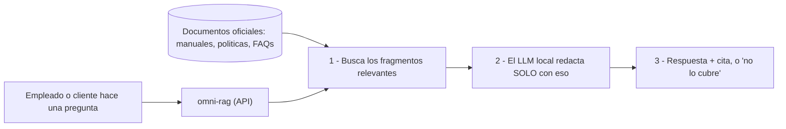

# omni-rag

**Plataforma de RAG para soporte y postventa retail** — responde preguntas usando
**solo** documentos indexados (manuales, políticas, FAQs), con **citas verificables**
y **sin alucinar**. Motor de IA **100% local** (Ollama): ningún dato sale de tu
infraestructura.

> Proyecto propio de **Mario A. Cabral**, ingenierizado a estándar de producción
> (API, bases de datos, tests, contenedores, observabilidad, CI/CD y despliegue en
> la nube). Pensado para el dominio de **soporte / postventa omnicanal**.

---

## ¿Por qué existe?

Un asistente de soporte que **inventa** un plazo de garantía o una política de
devolución es peor que no tener asistente. omni-rag responde **anclado** a los
documentos oficiales que le cargues y **cita la fuente** de cada afirmación; si la
respuesta no está en los documentos, lo dice — no la inventa.

## ¿Para qué sirve?

Imaginá el mostrador de una tienda o un call center. Un cliente pregunta:

> *"¿Este aire acondicionado tiene garantía y cuántos días tengo para devolverlo
> si no me convence?"*

En vez de buscar en una carpeta o dejar al cliente esperando, alguien —un
empleado, o directamente un chatbot— le pregunta a omni-rag y obtiene:

> *"Los productos electrónicos tienen 6 meses de garantía contra fallas. Tenés
> 30 días corridos para devolverlo sin uso, con el ticket [1]."*

…y con ese **[1]** puede ver de qué documento oficial salió la respuesta. Si la
pregunta no está en los documentos, responde **"La información disponible no
cubre ese punto"** en lugar de inventar.

**Casos de uso típicos:**

- **Soporte y postventa** — garantías, devoluciones, envíos, financiación.
- **Chatbot de atención al cliente** que solo contesta con información oficial.
- **Capacitación / onboarding** — el personal consulta procedimientos al instante.
- **Manuales técnicos** — *"¿cómo reseteo el modelo X?"*.
- Fuera del retail: estudios jurídicos, clínicas, bancos, seguros, RR. HH.

### ¿Cómo funciona? (en simple)



El valor no es solo *responder*: es **no mentir**. Un asistente que se inventa un
plazo de garantía es peor que no tener nada. omni-rag responde **anclado a los
documentos y citando la fuente**, y es **100% local** (los datos no salen de tu
infraestructura).

## Arquitectura (resumen)

```
                +-------------------+
   HTTP  --->   |   API (FastAPI)   |
                |  api / services   |
                +----+---------+----+
                     |         |
             embeddings/gen   vector store
                     |         |
                +----v----+  +-v------------------+
                | Ollama  |  | InMemory (M1)      |
                | local   |  | -> pgvector (M2)   |
                +---------+  +--------------------+
```

Capas del servicio API (`services/api/app/`):

| Capa | Responsabilidad |
|---|---|
| `api/` | Routers HTTP (health, documents, ask) + auth por API key |
| `services/` | chunking · embeddings (Ollama) · vector store · recuperación · RAG |
| `models/` | Schemas Pydantic (contrato de la API) |
| `config.py` · `logging_conf.py` | Configuración por entorno · logging JSON |

Decisiones de diseño documentadas en [`docs/adr/`](docs/adr/).

## Endpoints

| Método | Ruta | Qué hace |
|---|---|---|
| `GET` | `/health` | Liveness |
| `GET` | `/health/ready` | Readiness (comprueba Ollama, reporta el índice) |
| `POST` | `/documents` | Ingesta de texto |
| `POST` | `/documents/pdf` | Ingesta de PDF (indexa por página) |
| `GET` | `/documents` | Lista documentos indexados |
| `POST` | `/ask` | Pregunta (RAG con citas) |
| `GET` | `/docs` | Documentación OpenAPI (Swagger UI) |

## Cómo correrlo (local)

Requiere **Python 3.11+** y **[Ollama](https://ollama.com)** corriendo con los modelos:

```bash
ollama pull nomic-embed-text
ollama pull qwen2.5:7b
```

Luego:

```bash
cd services/api
python -m venv .venv
# Windows:  .venv\Scripts\activate
# Linux/Mac: source .venv/bin/activate
pip install -r requirements-dev.txt
uvicorn app.main:app --reload --port 8000
```

Abrí **http://localhost:8000/docs**.

### Ejemplo

```bash
# Ingestar una política
curl -X POST http://localhost:8000/documents -H "Content-Type: application/json" -d "{\"doc_id\":\"devoluciones\",\"title\":\"Politica de devoluciones\",\"text\":\"El cliente tiene 30 dias corridos para devolver un producto sin uso, con el ticket de compra.\"}"

# Preguntar
curl -X POST http://localhost:8000/ask -H "Content-Type: application/json" -d "{\"question\":\"Cuantos dias tengo para devolver?\"}"
```

## Tests

```bash
cd services/api
pytest
```

## Hoja de ruta

- [x] **M1** — API core RAG (FastAPI, capas, health/documents/ask, tests base)
- [ ] **M2** — PostgreSQL + pgvector + Redis
- [ ] **M3** — Tests + CI (GitHub Actions)
- [ ] **M4** — Docker + docker-compose
- [ ] **M5** — Microservicio en Go
- [ ] **M6** — Observabilidad (Prometheus + Grafana)
- [ ] **M7** — Despliegue en Render + manifiestos Kubernetes
- [ ] **M8** — Vitrina y pitch

## Licencia

MIT — ver [LICENSE](LICENSE).
